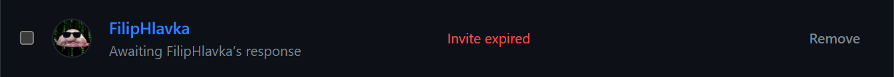

# Progress a rozdělení práce

## 0. Den Oct 16, 2023

Dostali jsme zadání a začali brainstormovat, jak by naše skvělá hra mohla vypadat.

Vytvořili jsme GitHub repo a Trello board pro lepší organizaci práce.

Tým měl za úkol si nainstalovat Unity Editor LTS verzi `2022.3.11f.1`, připojit se jako collaborator do GitHub repa a následně si ho naklonovat.

## 1. Den Oct 30, 2023

Začali jsme hodinu tak, že polovina týmu nemá správnou verzi Unity Editoru a nejsou ani připojeni jako colaboratoři v GitHub repu.

Upřesnili jsme si práci, některým se povedlo na projektu začít pracovat.

## Dnešní progress
| Člen týmu | Práce | 
| --- | --- |
| [LookupCz](https://github.com/LookupCz)               | 3D modely |
| [MatejUllman](https://github.com/MatejUllman)         | řešení pohybu |
| [FilipHlavka](https://github.com/FilipHlavka)         | instalace Unity Editoru |
| [lagemaxl](https://github.com/lagemaxl)               | ❌ |
| [PetrVorlos35](https://github.com/PetrVorlos35)       | animace a pohyb kamery, použití Cinemachine |
| [JakubGrezl](https://github.com/JakubGrezl)           | animace a pohyb kamery, použití Cinemachine |
| [Dejnyyy](https://github.com/Dejnyyy)                 | skládání beyblade mechaniky |
| [Mono777777](https://github.com/Mono777777)           | učení, jak udělat UI pro menu |
| [creeperplayer20](https://github.com/creeperplayer20) | research a návrhy SFX |
| [brynys](https://github.com/brynys)                   | ❌ |
| [Bagros](https://github.com/LosBagros)                | dostal za úkol team management, protože JJ nepřišel a ještě není co spojovat, snaha o donucení týmu vzájemně spolupracovat a dělat zadané tasky |

## 2. Den Dec 13, 2023

Všichni už mají správnou verzi Unity a rozdělila se práce podle návrhu.

Je hotový základní návrh mapy a kotoučů, začali se dělat další modely kotoučů a mapy a začalo se pracovat na pohybu a ovládání.

## Dnešní progress
| Člen týmu | Práce | 
| --- | --- |
| [LookupCz](https://github.com/LookupCz)               | 3D modely |
| [MatejUllman](https://github.com/MatejUllman)         | řešení pohybu a mechanik kotouče |
| [FilipHlavka](https://github.com/FilipHlavka)         | řešení pohybu a mechanik kotouče |
| [lagemaxl](https://github.com/lagemaxl)               | řešení pohybu a mechanik kotouče |
| [PetrVorlos35](https://github.com/PetrVorlos35)       | animace a pohyb kamery, rozvržení menu |
| [JakubGrezl](https://github.com/JakubGrezl)           | animace a pohyb kamery, rozvržení menu |
| [Dejnyyy](https://github.com/Dejnyyy)                 | ❌ |
| [Mono777777](https://github.com/Mono777777)           | screenshoty součástek beybladů |
| [creeperplayer20](https://github.com/creeperplayer20) | zvukování |
| [brynys](https://github.com/brynys)                   | předání plánu menu, předělání mechanik kotoučů |
| [Bagros](https://github.com/LosBagros)                | řešení problémů s Gitem, vizuální efekty a předání parametrů mezi dev1 a dev2 |

## 3. Den Dec 27, 2023

vytvoření základního návrhu menu, vylepšování pohybu, dodělání modelů kotoučů, návrky poro použití audia.

Tuto hodinu jsme se hlavě zaměřili na to aby byla práce správně rozložená a každý věděl co má dělat

## Dnešní progress
| Člen týmu | Práce | 
| --- | --- |
| [LookupCz](https://github.com/LookupCz)               | dokončení modelování všech kotoučů |
| [MatejUllman](https://github.com/MatejUllman)         | oprava bugů pohybu |
| [FilipHlavka](https://github.com/FilipHlavka)         | vylepšování a navrhování pohybu |
| [lagemaxl](https://github.com/lagemaxl)               | vylepšování a navrhování pohybu |
| [PetrVorlos35](https://github.com/PetrVorlos35)       | návrh menu a jeho graf. zpracování |
| [JakubGrezl](https://github.com/JakubGrezl)           | návrh menu a jeho graf. zpracování |
| [Dejnyyy](https://github.com/Dejnyyy)                 | testování hry a navrhování dalších map |
| [Mono777777](https://github.com/Mono777777)           | hledání hudebního doprovodu hry |
| [creeperplayer20](https://github.com/creeperplayer20) | rozvržení zvuku ve hře |
| [brynys](https://github.com/brynys)                   | práce na zlepšení kooperace týmu a zlepšení informovanosti |
| [Bagros](https://github.com/LosBagros)                | kontrola Gitu, pomoc na kooperaci podtýmů |
